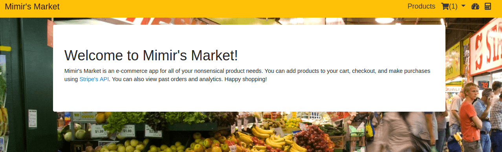

# Mimirs Market

An eCommerce store for Viking thunder Gods that like to buy "Antique Wooden Pizzas".

Mimirs Market is an eCommerce store that lets users browse products by searching or category, view their shopping cart, view past orders, and view analytics of all orders. When you're ready to checkout, you can use [Stripe's API](https://stripe.com/docs/api) to make a fake purchase.

Mimir's Market runs in Node.js, using Express.js for the server, Handlebars templates for the views, and Mongoose and Sequelize for interacting with MongoDB and Postgres databases respectively.

To run this project locally, you'll need to have Node.js installed. You'll also need to make sure you have both MongoDB and Postgres installed and running on your local machine.You'll also need two API keys from stripe, a secret one and a test one. Save them as STRIPE_PK and STRIPE_SK in your environment variables. You'll need to modify the configuration files in the Config folder to give the project access to your postgres database.

Once your setup is complete, run "npm install" in the directory's terminal to install dependencies, "npm run seed" to seed your databases, and finally "npm start" to start up the server. In your browser you can then navigate to "http://localhost:3000" and start shopping!
